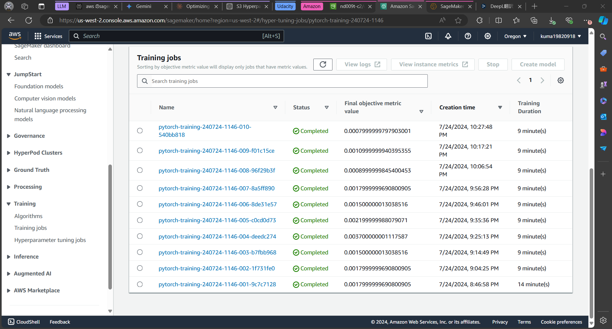
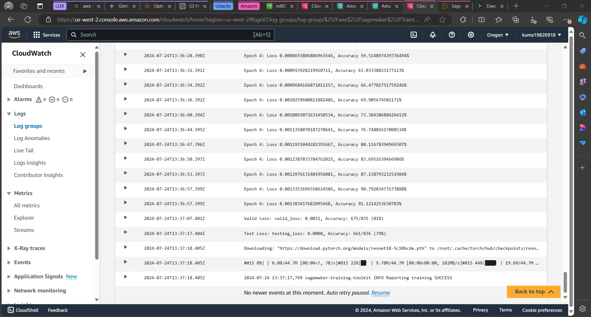
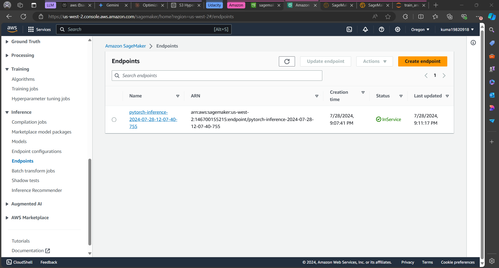

# Image Classification using AWS SageMaker

Use AWS Sagemaker to train a pretrained model that can perform image classification by using the Sagemaker profiling, debugger, hyperparameter tuning and other good ML engineering practices. This can be done on either the provided dog breed classication data set or one of your choice.

## Project Set Up and Installation
Enter AWS through the gateway in the course and open SageMaker Studio. 
Download the starter files.
Download/Make the dataset available. 

## Dataset
The provided dataset is the dogbreed classification dataset which can be found in the classroom.
The project is designed to be dataset independent so if there is a dataset that is more interesting or relevant to your work, you are welcome to use it to complete the project.

### Access
Upload the data to an S3 bucket through the AWS Gateway so that SageMaker has access to the data. 

## Hyperparameter Tuning
### About Model in this project 
I selected RESNET18 because it has simple and efficient structure
Number of Layers: Despite the relatively shallow number of layers (18), it performs as well as a deep network. This is achieved through a structure called residual blocks.
### Tuned Hyperparameter
* learning rate: [0.01, 0.1]
    * Definition: The step size for updating the parameters of the model.
    * Role: If the learning rate is too large, oscillations will occur and convergence to an optimal solution will be difficult. Conversely, if it is too small, learning will be very slow.
* momentum: [0.01, 0.9]
    * Definition: A technique to add inertia in the direction of parameter updates to stabilize the direction to the optimal solution and prevent falling into a local solution.
    * Role: Introducing momentum allows for smoother movement to the optimal solution in error functions where the parameters are trough-like in shape.

### Result
* Completed training jobs

* Logs metrics during the training process

* Best training job hyperparameters

## Debugging and Profiling
I configured a debugging and profiling setup for a machine learning model, likely being trained using a framework like PyTorch and deployed on Amazon SageMaker. 

* Rule Configuration
    * vanishing_gradient(): This rule is designed to monitor for the vanishing gradient problem * during training. Vanishing gradients can hinder the training process by causing the gradients to become extremely small, making it difficult for the model to learn.
    * overfit(): This rule checks for overfitting, a condition where the model becomes too specialized to the training data and performs poorly on unseen data.
    * ProfilerReport(): This rule enables profiling, which involves collecting performance metrics about the training process.

By monitoring for vanishing gradients, overfitting, and collecting performance metrics, it helps in:

* Identifying and addressing training issues: The rules help detect common problems like vanishing gradients and overfitting, allowing for timely adjustments to the model or training process.
* Optimizing performance: The profiler provides insights into the computational efficiency of the model, enabling developers to identify bottlenecks and optimize the code.
* Ensuring model quality: By monitoring the model's behavior during training, developers can ensure that the model is learning effectively and generalizing well to new data.

### Results
The phenomenon where the loss temporarily worsens during deep learning training is known as `Deep Double Descent`. This behavior is attributed to the characteristics of deep learning. Based on my research, I believe the following two approaches are effective:

* Regularization: I will re-run the experiment by setting a regularization term in the criterion.
* Parameter size variation: I will use models with different parameter sizes.

## Model Deployment

I deployed a PyTorch model to a SageMaker endpoint and then uses that endpoint to make a prediction on an image. Here's a breakdown of the steps:

1. Define Serializers and Predictor Class:
* jpeg_serializer: This specifies that the input data for the endpoint will be in JPEG image format.
* json_deserializer: This specifies that the output from the endpoint will be in JSON format.
ImagePredictor: This class inherits from the sagemaker.predictor.Predictor class and defines the specific serializer and deserializer to be used for image prediction.

2. Load the Model:
* model_data: This variable holds the path (S3 location) of the trained PyTorch model archive (.tar.gz).
* pytorch_model: This creates a PyTorchModel object using the model data, along with other parameters like the IAM role, entry script (pred.py), Python version, framework version (PyTorch 1.8), and the custom predictor class (ImagePredictor).

3. Deploy the Model:
* deploy(initial_instance_count=1, instance_type='ml.m5.large'): This deploys the PyTorch model to a SageMaker endpoint.

4. Make a Prediction:
* Opens the image file "Affenpinscher_00003.jpg" in binary read mode.
* payload: Reads the image content into a byte array.
* predictor.predict(payload): Sends the image data (payload) to the deployed endpoint for prediction.

5. Process Prediction Output:
* inference: This variable holds the prediction results returned by the endpoint (likely probabilities for different classes).
* np.argmax(inference) + 1: This uses NumPy to find the index of the class with the highest probability in the prediction output and adds 1 (assuming class indices start from 0).

* Screenshot of the deployed active endpoint in Sagemaker

## Standout Suggestions
**TODO (Optional):** This is where you can provide information about any standout suggestions that you have attempted.
